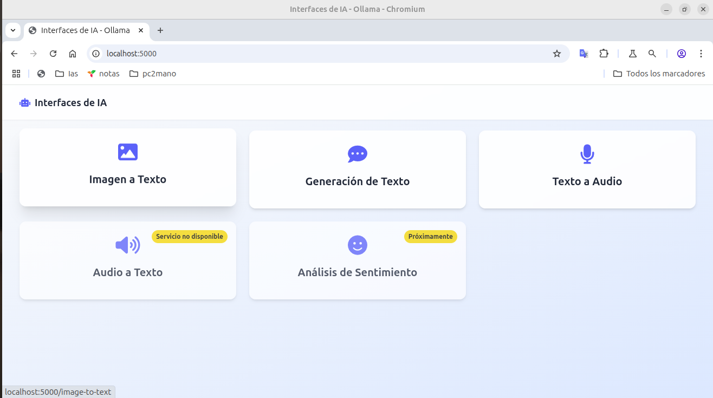

# 🧠 Aplicación Web de Servicios de IA Locales

Esta es una aplicación web minimalista que permite interactuar con distintos servicios locales de inteligencia artificial a través de formularios sencillos. Entre sus funcionalidades principales se incluyen:

- ✅ Generación de texto con Ollama

- 🖼️ Conversión de texto a imagen

- 🔊 Conversión de texto a voz

- 🎤 Reconocimiento de voz (voz a texto)

  

pruebas iniciales esta sin terminar
